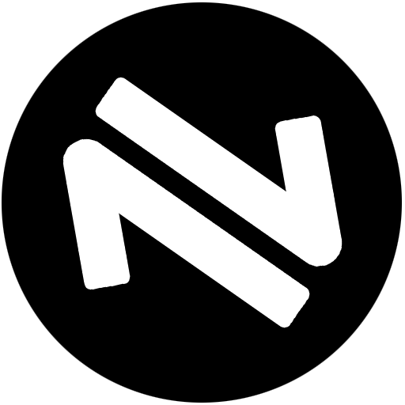

<h1>
SOLIDRAW (솔리드로우)
</h1>

<div align="center">
    <image src="static/img/solidraw-logo.png">
    <h3>손 스케치 건축도면 변환 웹 애플리케이션</h3>
    <p>2022 DEU LINC 3.0 통합 성과대회 출품작 <strong>(우수상🥈)</strong></p>
</div>

<br />
    
```
동 대학 건축학과 학생들을 대상으로 한 앙케이트 조사 '이런 소프트웨어가 있었으면 좋겠다!'를
통해 얻은 아이디어로 개발한 컴퓨터공학과 2022 캡스톤디자인 프로젝트, SOLIDRAW를 소개합니다.
```

<br />

## 3줄 요약
        
<image src="static/img/docs/docs-io.png" style="width: 400px;">
    
- 손으로 스케치한 건축 평면도를 <strong>SOLID</strong>한 평면도로 변환
- 손 스케치 도면 이미지 파일을 웹앱에 입력
- 보정된 평면도 이미지를 출력

<br />

## 프로젝트 소개

<div align="center">
    <p><strong>2022 LINC 3.0 동의대학교 통합 경진대회을 위해 디자인한 리플렛🌿입니다.</strong></p>
    <image src="static/img/docs/leaflet-front.png" alt="리플렛-앞면">
    <image src="static/img/docs/leaflet-back.png" alt="리플렛-뒷면">
</div>

<br />


## 👥 졸업은하겠조

|[손다연](https://github.com/dyson1357)|[김도영](https://github.com/kkamag)|[신동호](https://github.com/khakhid)|
|---|---|---|
| <div align="center"></div> | <div align="center"></div> | <div align="center"></div> |
| <strong>백엔드</strong> <br />- 팀장<br />- Flask 서버 구축<br />- 도면 변환 로직 구현 | <strong>백엔드</strong> <br />- Flask 서버 구축<br /> - 도면 변환 로직 구현| <strong>프론트엔드</strong> <br />- 웹 디자인<br />- 전체 페이지 개발<br />- 리플렛 제작  |

<br />

## 🛠️ 사용 기술

<table>
<tr>
 <td align="center">언어</td>
 <td>
   
   
   
   
 </td>
</tr>
<tr>
 <td align="center">프레임워크</td>
 <td>
    
 </td>
</tr>
<tr>
 <td align="center">협업 툴</td>
 <td>
    
    
    
 </td>
</tr>
<tr>
    <td align="center">기타</td>
    <td>
        <a href="https://scrollrevealjs.org/" target="_blank">ScrollReveal</a> &nbsp;&nbsp; <a href="https://swiperjs.com/" target="_blank">Swiper</a> &nbsp;&nbsp; <a href="https://www.kakaoicloud.com/service/detail/6-9" target="_blank">Kakao OCR</a>
    </td>
</table>

<br />
